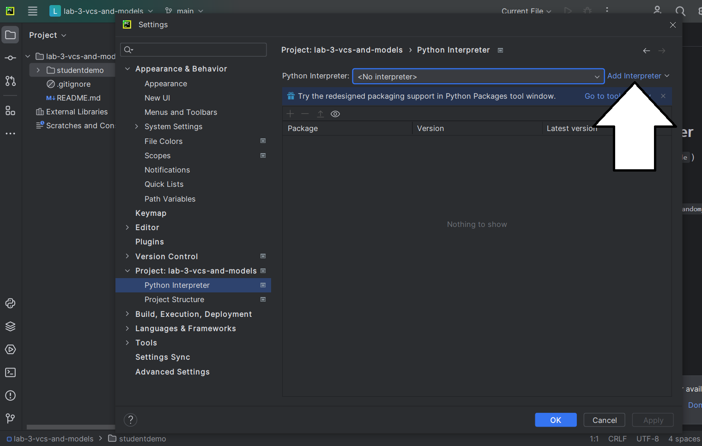
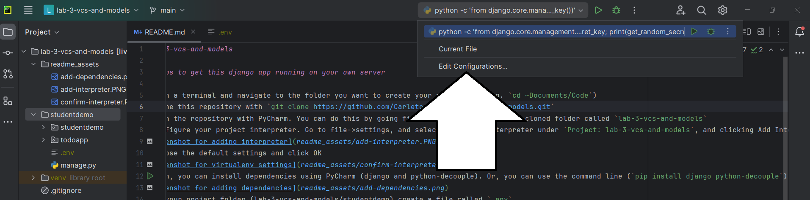
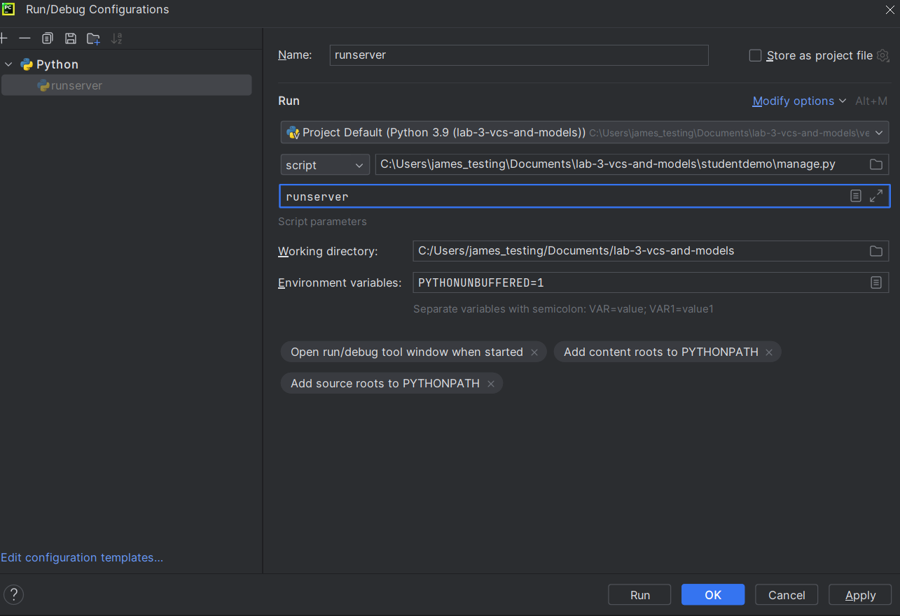

# simple-django
## Steps to get this django app running on your own server

1) Open a terminal and navigate to the folder you want to create your project in (e.g. `cd ~Documents/Code`)
2) Clone this repository with `git clone https://github.com/Carleton-BIT/simple-todoapp-django.git`
3) Open the repository with PyCharm. You can do this by going file->open and selecting the cloned folder called `simple-todoapp-django`
4) Configure your project interpreter. Go to file->settings, and selecting Python Interpreter under `Project: simple-todoapp-django`, and clicking Add Interpreter->Add Local Interpreter

5) Choose the default settings and click OK

6) Then, you can install dependencies using `pip install -r requirements.txt`
7) Create a run configuration:

8) Configure it to run manage.py with the parameter runserver:

9) Create a file called `.env` in the simple-todoapp-django folder
10) Generate a secret key by running `python -c 'from django.core.management.utils import get_random_secret_key; print(get_random_secret_key())'` in the terminal. Copy the output.
11) Edit `.env` (created in part 9) with a text editor like notepad, and add a line that says `SECRET_KEY="your-secret-key-here"`. Paste the output from part 10 into 'your-secret-key-here'.
12) On the terminal, navigate to `lab-3-vcs-and-models/studentdemo` and run `python manage.py migrate`
13) Run the server by clicking the play button for the run configuration you set up
14) Navigate to 127.0.0.1:8000! Your app should load.
